# Coffee-Donuts-Visual-Recognition
Wake Up with Coffee and Donuts Visual Recognition - Hands on Lab

## Introduction

This hands on lab uses breakfast images, Watson Studio and Watson Visual Recognition to detect your favorite donuts, coffee mugs and bags of eye-opening coffee.


## Learning objectives

After completing this tutorial you will be able to:

* Create a Visual Recognition model in Watson Studio running in IBM Cloud
* Capture images of Coffee Mugs, Coffee Bags and Donuts and zip them into a class (provided)
* Train a model to identify objects in the images
* Score the identified objects

## Prerequisites

This tutorial can be completed using an IBM Cloud Lite account.

* Create an [IBM Cloud account](http://ibm.biz/osseucoffeelab)
* Log into [IBM Cloud](https://cloud.ibm.com/login)

## Estimated time

You can complete this task in no more than 20 minutes.

# Hands on Lab Overview

The outline below provides a high level overview of the steps included in the lab instructions.

## Step 1 - Capturing Images

In this lab, we have created three zip files of pictures. The lab will use these images to identify
coffee mugs, bags of coffee beans and donuts. These images will be used as our training set.

- Grab them all [here](classes)
- Images of bags of Coffee Beans - [CoffeeBag.zip](classes/CoffeeBag.zip)
- Images of Coffee Mugs - [CoffeeMug.zip](classes/CoffeeMug.zip)
- Images of Donuts - [Donut.zip](classes/Donut.zip)

## Step 2 - Watson Studio

In this section, we will create a Watson Studio account, create a Project and Watson Visual Recognition model to identify images in several classes.

- Create a Watson Studio account - follow these [instructions](STUDIO.md)
- Create a Project
- Create a Visual Recognition model - follow these [instructions](VISRECO.md)
- Upload three zip files to Cloud Object Storage
- Create a class *Coffee Bag* - drag a zipfile
- Create another class *Coffee Mug* - drag a zipfile
- Create another class *Donut* - drag a zipfile
- Train your model - wait a few minutes

## Step 3 - Test your model
In this section you will use sample images to confirm your model.
- Test your model - follow these [instructions](VRMTEST.md)

## Step 4 - Implement this model in your Application

- Embed your model into an application using these code snippets

Let's get started - Set up Watson Studio

# Watson Studio Set up and Configuration in IBM Cloud

## Lab Objectives

In this lab you will set up Watson Studio with a new Project.  You will learn:

- Watson Studio
- How to set up a new Watson Studio Project

### Introduction

Watson Studio accelerates the machine and deep learning workflows required to infuse AI into your business to drive innovation. It provides a suite of tools for data scientists, application developers and subject matter experts, allowing them to collaboratively connect to data, wrangle that data and use it to build, train and deploy models at scale. Successful AI projects require a combination of algorithms + data + team, and a very powerful compute infrastructure.

- Learn more from the Experts - [Introducing IBM Watson Studio](https://medium.com/ibm-watson/introducing-ibm-watson-studio-e93638f0bb47)

### Watson Studio Setup

#### Log into Watson Studio

- If you created a **Watson Studio** service instance in a prior lab, you can relaunch Watson Studio by visiting [http://dataplatform.cloud.ibm.com](http://dataplatform.cloud.ibm.com/)
- Skip the next **Create a Watson Studio service instance** section if you do not need to create a new Watson Studio instance. (Only one Watson Studio instance is allowed per IBM Cloud Lite account).  Jump to the **Watson Studio Projects** section.
- If you want to learn how to navigate the [IBM Cloud Dashboard](https://cloud.ibm.com), click on [Services](https://cloud.ibm.com/resources), then search for *studio* in the masthead.
  - **Tip:** Here's a shortcut to locate you [Watson Studio instance](https://cloud.ibm.com/resources?search=studio)
  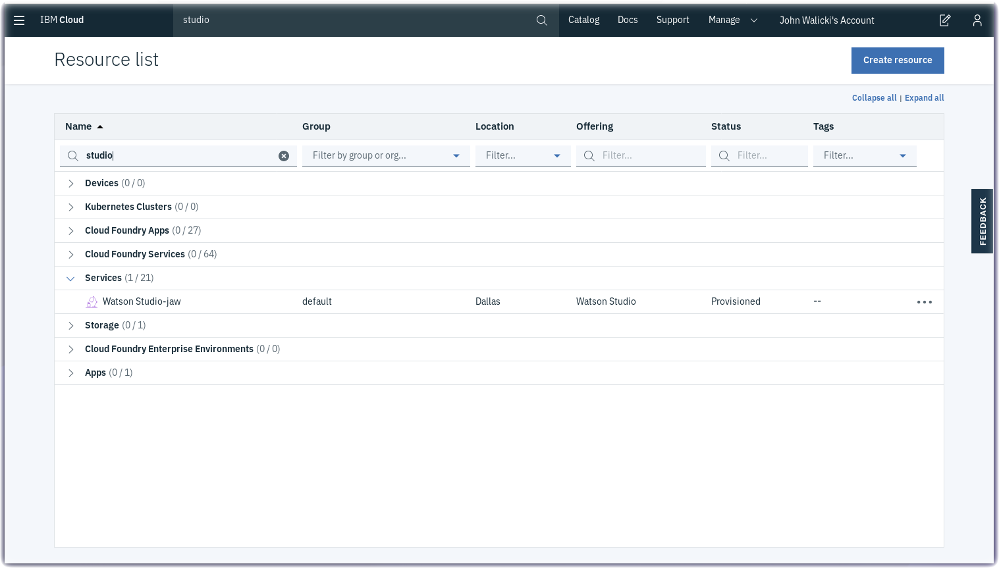
  - Click on the Watson Studio instance to open and launch Watson Studio.

<div style="page-break-after: always;"></div>
#### Create a Watson Studio service instance
- Create a **Watson Studio** service instance from the [IBM Cloud Catalog](https://cloud.ibm.com/catalog/?search=studio)
- Search on **Studio** in the IBM Cloud Catalog


- Click on the **Watson Studio** service tile


- Click on the **Create** button
- After the Watson Studio service is created, click on **Get Started** or visit Watson Studio at <https://dataplatform.cloud.ibm.com/>


- Login with your IBM Cloud account
- Walk through the introductory tutorial to learn about Watson Studio

### Watson Studio Projects

Projects are your workspace to organize your resources, such as assets like data, collaborators, and analytic tools like notebooks and models

#### Create a New Project

- Click on **Create a Project**
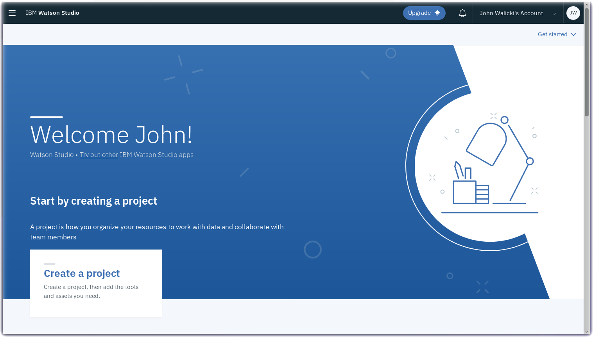

- Select the **Create an empty project** tile

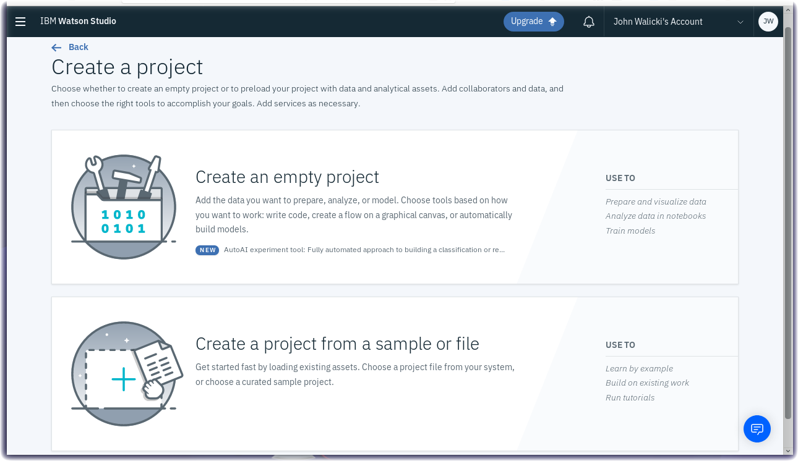

- Give your Project a name : **Coffee or Donuts**
- Click on **Add** to define a Cloud Object Storage instance

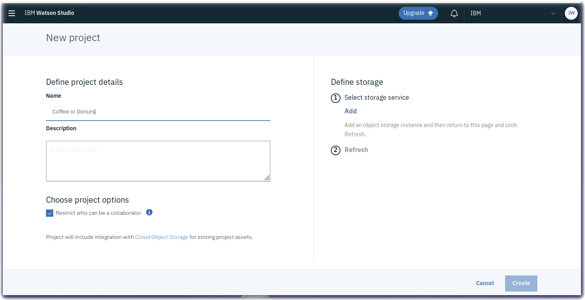

<div style="page-break-after: always;"></div>
#### Create Cloud Object Storage
- You will store images and training data in a Cloud Object Storage bucket
- Select the **Lite** plan and note the features
- Scroll to the bottom and click on the **Create** button and then **Confirm** to create a Cloud Object Storage instance.

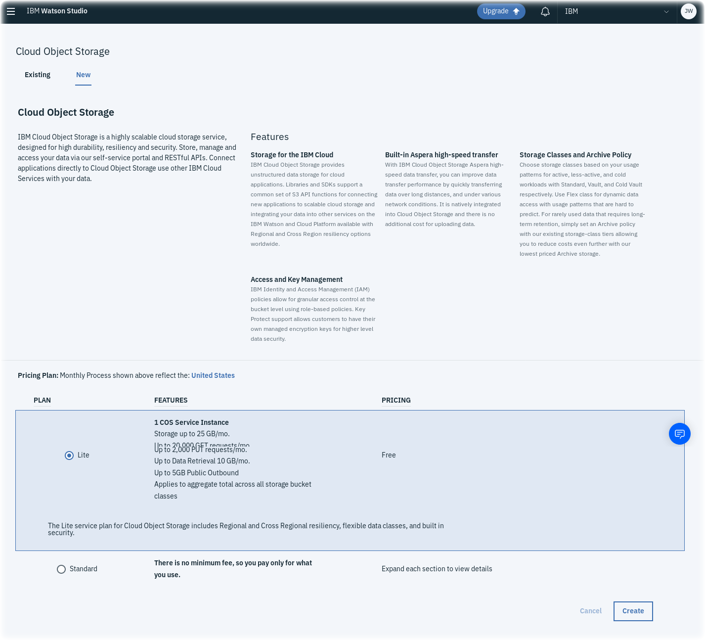

<div style="page-break-after: always;"></div>

- Watson Studio will spin for a few seconds while **Preparing Watson Studio** project.  New instances of Watson Visual Recognition and Cloud Object Storage will be created.

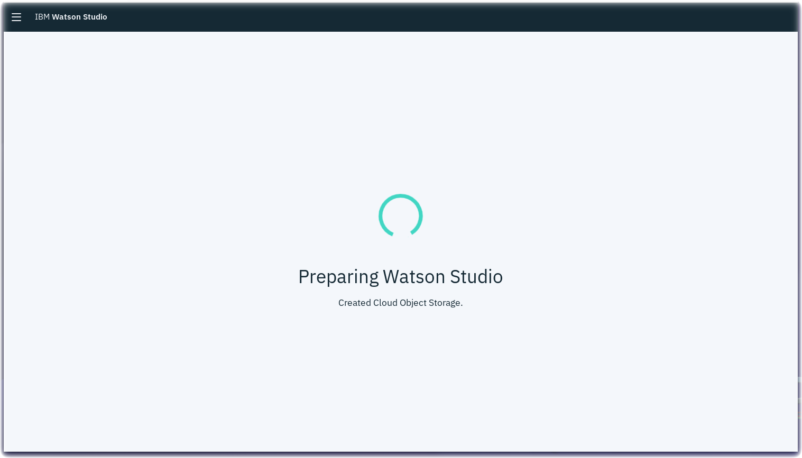

- Click on **Refresh** on the New Project tab.
- Click on **Create** to create the new project.

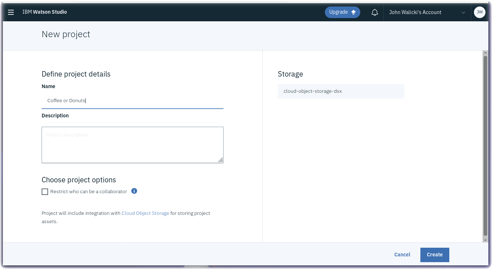

<div style="page-break-after: always;"></div>

- Click on **Add to project**


- Select **Visual Recognition model** on the **Choose asset type** popup.

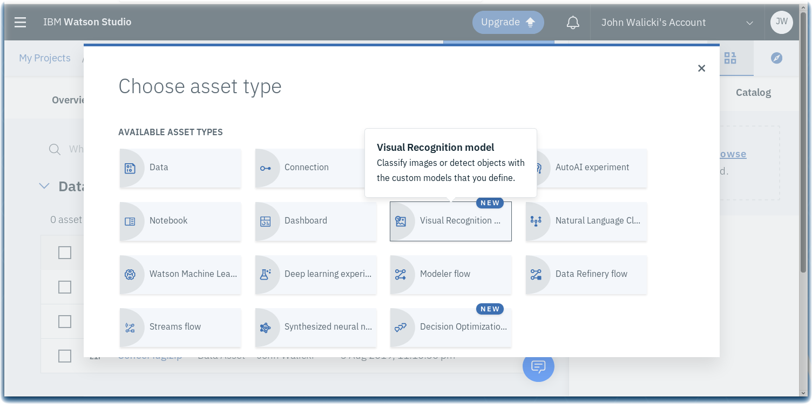

<div style="page-break-after: always;"></div>

#### Provision a new Watson Visual Recognition Service instance
- Your project needs to be associated with a Watson Visual Recognition Service instance
- Click on the **click here** link in the popup to Associate a Watson Visual Recognition service.

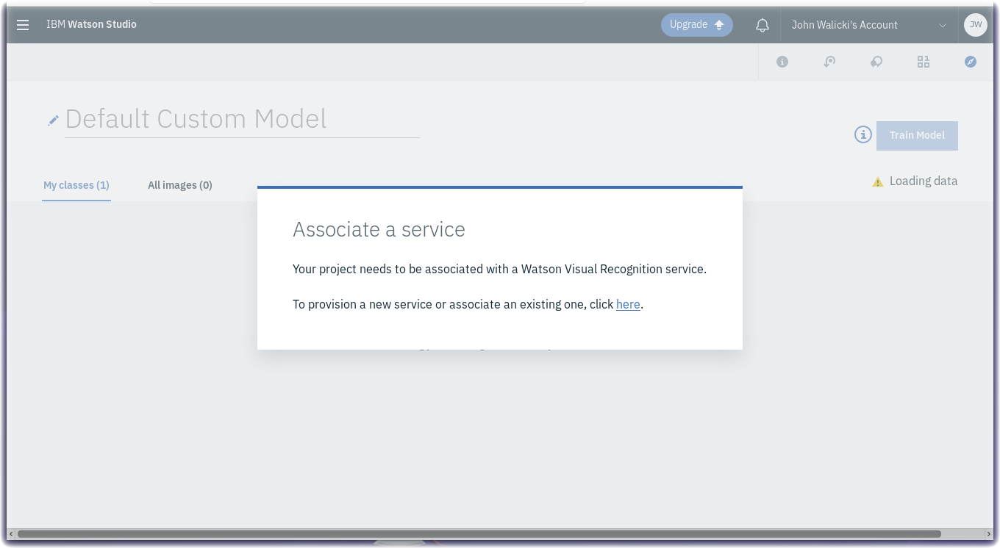

<div style="page-break-after: always;"></div>

#### Create a Watson Visual Recognition Service
- Select the **Lite** plan and note the features
- Scroll to the bottom and click on the **Create** button


<div style="page-break-after: always;"></div>

- Select a region for Visual Recognition

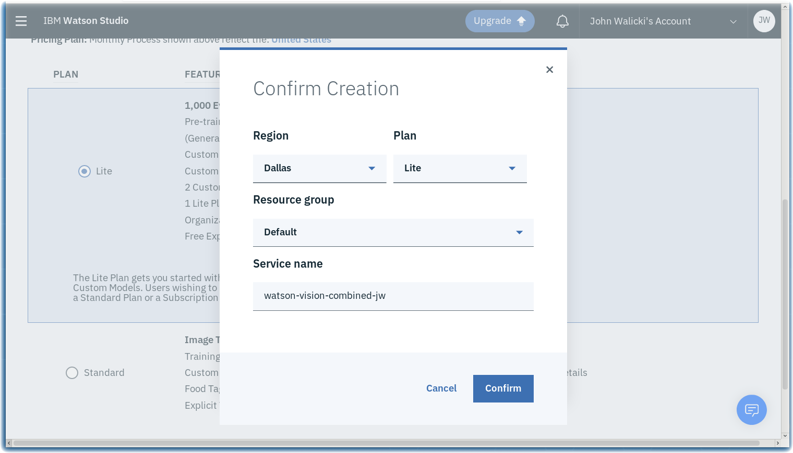

- Select **Classify Images** on the **Custom Models** page.


You are ready to set up your Project with Watson Visual Recognition. Proceed to the next [step](VISRECO.md)

***
<div style="page-break-after: always;"></div>

## Lab Objectives

In this lab you will create a Visual Recognition model in a Watson Studio Project.  You will learn:

- How to work within a new Watson Studio Project
- How to create a Visual Recognition model

### Watson Studio Projects

Projects are your workspace to organize your resources, such as assets like data, collaborators, and analytic tools like notebooks and models.

#### Rename Visual Recognition Model
- The **Default Custom Model** name is not descriptive so let's rename it
- Click on the **pencil** icon to edit the name


<div style="page-break-after: always;"></div>
- Rename the model to **Coffee or Donuts**


#### Add Custom Classes to the Watson Visual Recognition Model
- Click on the **+** symbol to add a class


- Name this class **Coffee Bag**
- Click the **Create** button


- Add a second custom class by clicking on the **+** symbol again


- Name this class **Coffee Mug**
- Click the **Create** button


- Add a third custom class by clicking on the **+** symbol again

- Name this class **Donut**
- Click the **Create** button


<div style="page-break-after: always;"></div>
#### Upload Zip Files to Watson Studio Project
- Three zip files have been prepared which contain coffee and donut images
- If you are following these steps in an IBM Booth at a conference, these zip files may already be downloaded onto the QuickLab laptop.  
- If you are following these steps on the web, download the zip files here:
  - [CoffeeBag.zip](classes/CoffeeBag.zip)
  - [CoffeeMug.zip](classes/CoffeeMug.zip)
  - [Donut.zip](classes/Donut.zip)
- Click on the **Browse** button
- An operating system native File Dialog will open
- Multi-select the three zip files **CoffeeBag.zip**, **CoffeeMug.zip**, **Donut.zip**
- Upload these zip files to your Watson Studio project


#### Drag the zip files to Custom Classes
- Grab the **CoffeeBag.zip** from the right navigation and drag it to the **Coffee Bag** class


- The images in the zip file will be added to the **Coffee Bag** class


- Grab the **CoffeeMug.zip** from the right navigation and drag it to the **Coffee Mug** class


- Grab the **Donut.zip** from the right navigation and drag it to the **Donut** class


- This custom classifier does not contain a **Negative** zip file.  It is recommended but not required.

<div style="page-break-after: always;"></div>
#### Train your Watson Visual Recognition Custom Classifier
- Click on the **Train Model** button
- Wait a few (5-10) minutes for the model to train on the images


#### Congratulations
- Once the model has been trained, click on the **Click here** link or the **Trained** link to view and test your model.


#### Review and Test
- Review the Classes and Model details
- Click on the **Test** tab


***

## Lab Objectives

In this lab you will use sample images to confirm your Visual Recognition model. You will learn:

- How to test your Visual Recognition model using sample images
- How to incorporate your Visual Recognition Custom Classifier model into your applications

#### Review and Test
- Review the Classes and Model details
- Click on the **Test** tab


<div style="page-break-after: always;"></div>
### Test Watson Visual Recognition Custom Classifier with sample images
- Visit the [Test Data directory](testdata) and **download** the testdata.zip file.  This zip file contains PNG and JPG images
- Unlike the training datasets, you will need to **unzip** the images onto your local hard drive
- Inspect a few of the breakfast images using a local image viewing utility or file browser
- These images were not part of the training set and will be used to validate the visual recognition model
- Return to the **Test** tab in the Watson Studio Flooding project
- There are two techniques to upload the images into the **Test** page
  - Drag the individual images from your local file browser into the Test page
  - Click on the **browse** link to open a file selection dialog


- The trained custom classifier model will analyze the images
<div style="page-break-after: always;"></div>
- Inspect the **Confidence scores** returned by the Watson Visual Recognition Custom Classifier


<div style="page-break-after: always;"></div>
### Implement Watson Visual Recognition custom model in your Applications
- You can incorporate this Watson Visual Recognition Custom Classifier model into your applications using a variety of programming languages - Java, Node, Python, Ruby, Core ML
- Click on the **Implementation** tab to review the Code snippets

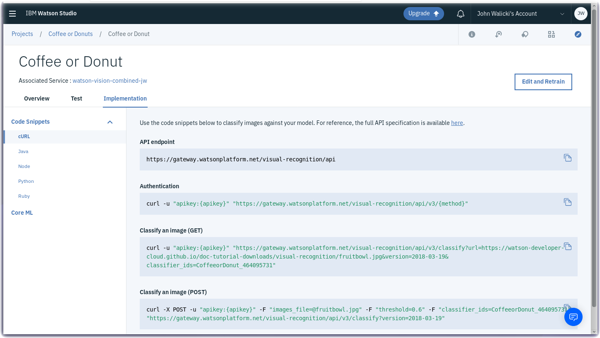

Use the code snippets below to classify images against your model. For reference, the full API specification is available [here](https://www.ibm.com/watson/developercloud/visual-recognition/api/v3/)

In the IBM Cloud Dashboard, search for and open your instance of *Watson Visual Recognition* and navigate into the Service Credentials section. Copy your **apikey** for use in the curl examples below.

- **API endpoint**

  ```
  https://gateway.watsonplatform.net/visual-recognition/api
  ```

- **Authentication**

  ```
  curl -u "apikey:{apikey}" "https://gateway.watsonplatform.net/visual-recognition/api/{method}"
  ```

- **Classify an image (GET)**

  ```
  curl -u "apikey:{apikey}" "https://gateway.watsonplatform.net/visual-recognition/api/v3/classify?url=https://watson-developer-cloud.github.io/doc-tutorial-downloads/visual-recognition/fruitbowl.jpg&version=2018-03-19&classifier_ids=CoffeeorDonuts_418020421"
  ```

- **Classify an image (POST)**

  ```
  curl -X POST -u "apikey:{apikey}"-F "images_file=@fruitbowl.jpg" -F "threshold=0.6" -F "classifier_ids=CoffeeorDonuts_418020421" "https://gateway.watsonplatform.net/visual-recognition/api/v3/classify?version=2018-03-19"
  ```

### Congratulations
  You have completed the Coffee or Donuts Visual Recognition Lab and have identified Coffee Bags, Coffee Mugs and yummy donuts.

### Visual Recognition - Additional References
- [Locate and count items with object detection](https://developer.ibm.com/code/patterns/locate-and-count-items-with-object-detection/)
- [MAX Object Detection](https://developer.ibm.com/exchanges/models/all/max-object-detector/)
