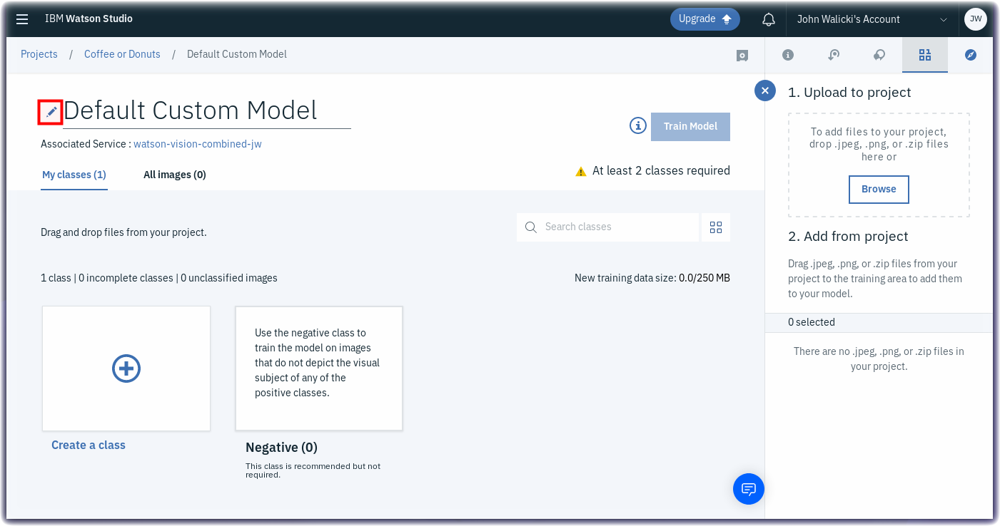
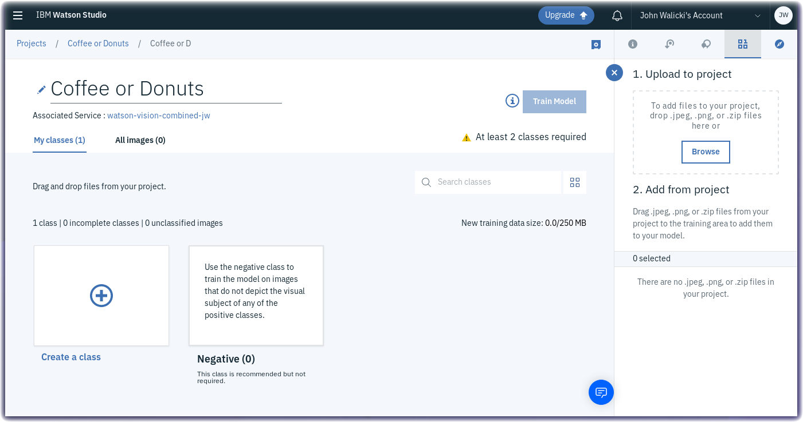
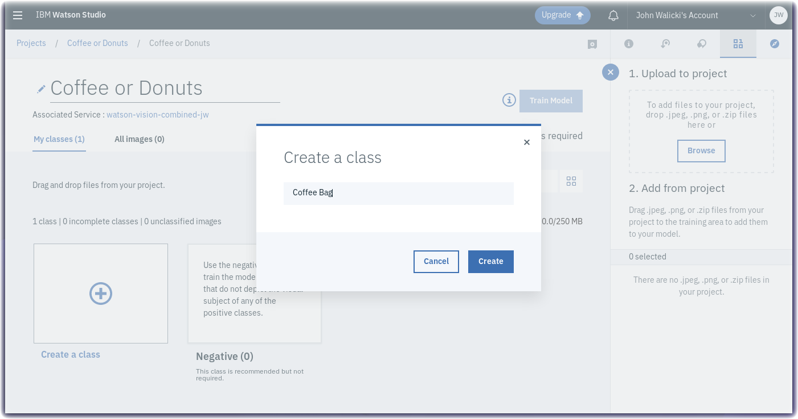
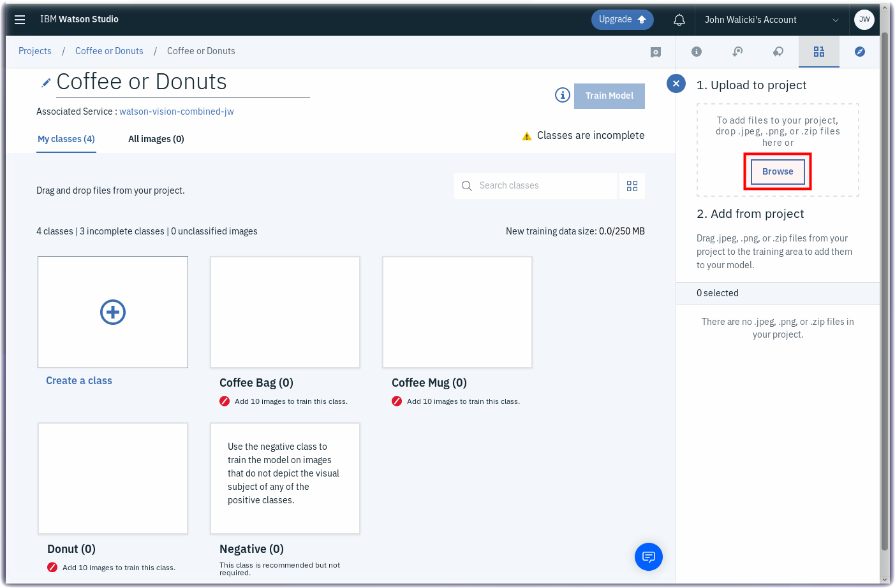
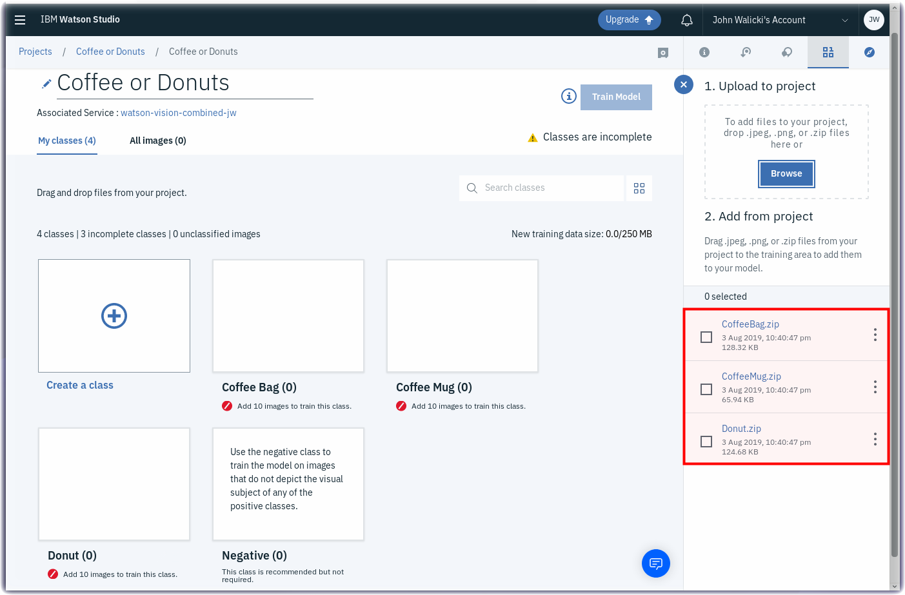
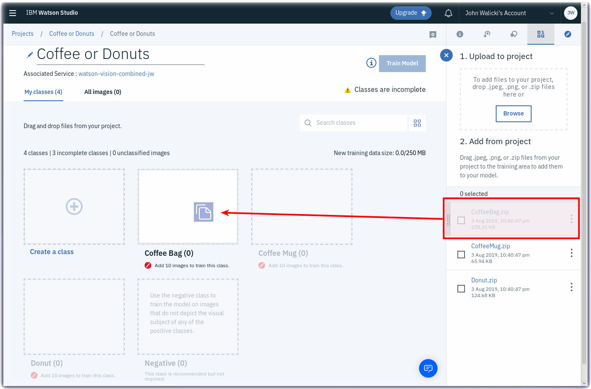
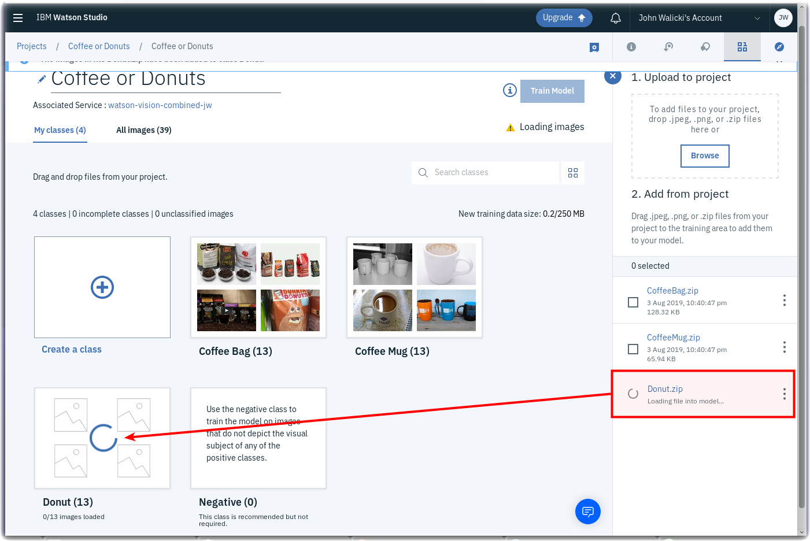
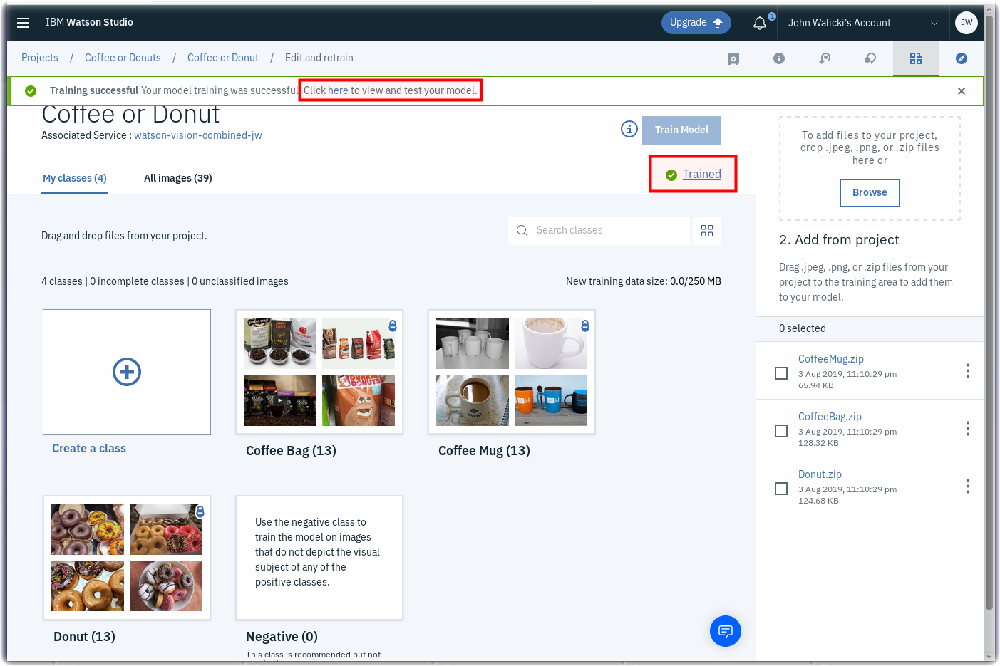

*Quick links :*
[Coffee](README.md) - [Watson Studio](STUDIO.md) - [**Visual Recognition Model**](VISRECO.md) - [Test and Deploy](VRMTEST.md)
***

## Lab Objectives

In this lab you will create a Visual Recognition model in a Watson Studio Project.  You will learn:

- How to work within a new Watson Studio Project
- How to create a Visual Recognition model

### Watson Studio Projects

Projects are your workspace to organize your resources, such as assets like data, collaborators, and analytic tools like notebooks and models.

#### Rename Visual Recognition Model
- The **Default Custom Model** name is not descriptive so let's rename it
- Click on the **pencil** icon to edit the name

- Rename the model to **Coffee or Donuts**

#### Add Custom Classes to the Watson Visual Recognition Model
- Click on the **+** symbol to add a class

- Name this class **Coffee Bag**
- Click the **Create** button

- Add a second custom class by clicking on the **+** symbol again

- Name this class **Coffee Mug**
- Click the **Create** button

- Add a third custom class by clicking on the **+** symbol again

- Name this class **Donut**
- Click the **Create** button

#### Upload Zip Files to Watson Studio Project
- Three zip files have been prepared which contain coffee and donut images
- If you are following these steps in an IBM Booth at a conference, these zip files may already be downloaded onto the QuickLab laptop.  
- If you are following these steps on the web, download the zip files here:
  - [CoffeeBag.zip](classes/CoffeeBag.zip)
  - [CoffeeMug.zip](classes/CoffeeMug.zip)
  - [Donut.zip](classes/Donut.zip)
- Click on the **Browse** button
- An operating system native File Dialog will open
- Multi-select the three zip files **CoffeeBag.zip**, **CoffeeMug.zip**, **Donut.zip**
- Upload these zip files to your Watson Studio project

#### Drag the zip files to Custom Classes
- Grab the **CoffeeBag.zip** from the right navigation and drag it to the **Coffee Bag** class

- The images in the zip file will be added to the **Coffee Bag** class

- Grab the **CoffeeMug.zip** from the right navigation and drag it to the **Coffee Mug** class

- Grab the **Donut.zip** from the right navigation and drag it to the **Donut** class

- This custom classifier does not contain a **Negative** zip file.  It is recommended but not required.

#### Train your Watson Visual Recognition Custom Classifier
- Click on the **Train Model** button
- Wait a few (5-10) minutes for the model to train on the images

#### Congratulations
- Once the model has been trained, click on the **Click here** link or the **Trained** link to view and test your model.

#### Review and Test
- Review the Classes and Model details
- Click on the **Test** tab

Test your model in the next [step](VRMTEST.md)

*Quick links :*
[Coffee](README.md) - [Watson Studio](STUDIO.md) - [**Visual Recognition Model**](VISRECO.md) - [Test and Deploy](VRMTEST.md)
